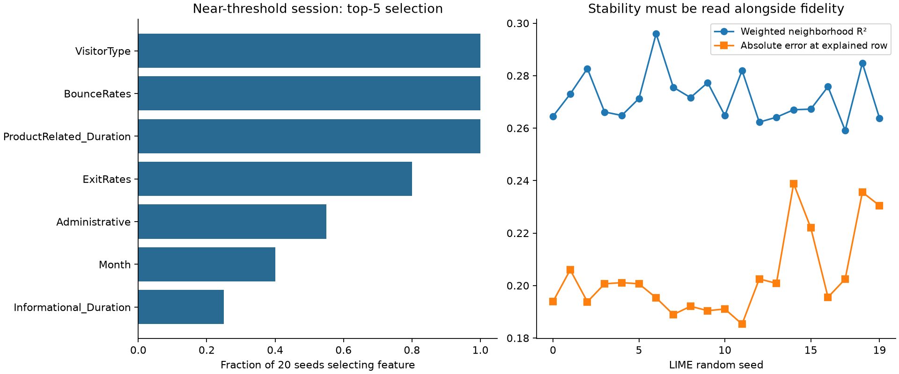
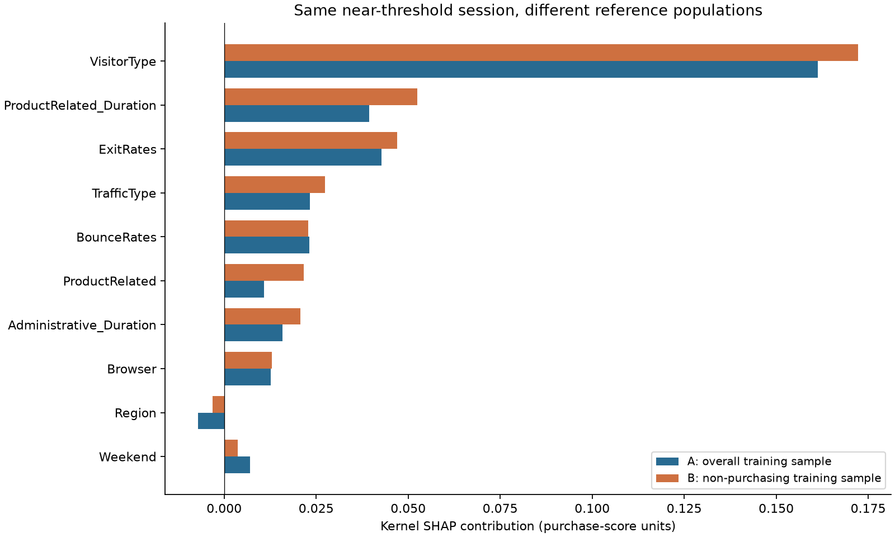
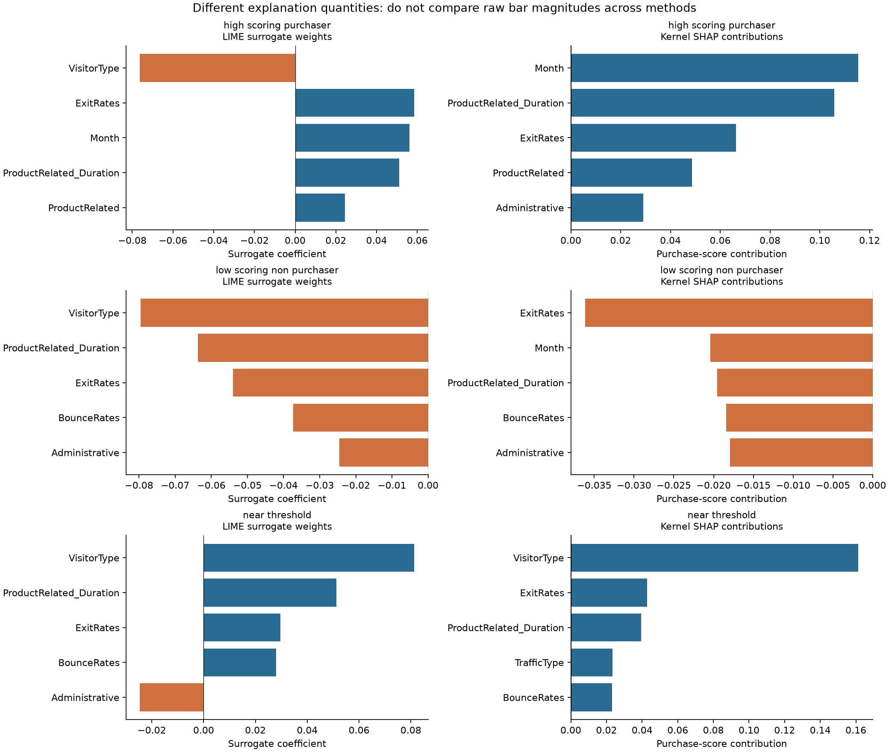

# Case 4 experiment results: Why Does the Model Think This Shopper Will Buy?

## 1. Frozen case definition

**Why Does the Model Think This Shopper Will Buy?** Chapter: model-agnostic local explanations using LIME and SHAP.

Primary question: **Can we trust the explanation of an individual online-shopping prediction?** This is an explanation audit. The human-frozen design was executed without model competition, new post-result experiments, or a final teaching notebook. Numerical artifacts and figures are in [case4_online_shopping/](case4_online_shopping/); working entry point: [research script](../run_case4_online_shopping_experiments.py).

## 2. Prediction contract and limitations

Target: `Revenue`, whether a completed session ended in a recorded purchase. The outcome is a behavioral proxy, not shopper psychology or true purchase intention. This is **offline session-level prediction and explanation auditing**.

An operational analogue might support analytics, UX analysis, personalization, or assistance, but would need genuinely decision-time inputs, timestamped feature provenance, a reproducible within-session cutoff, prospective evaluation, and evidence about intervention effects. These session aggregates establish none of those deployment claims. Removing PageValues does not make the remaining totals valid early-session measurements.

## 3. Feature policy

PageValues is excluded because its as-of validity cannot be established sufficiently. This is not a declaration of confirmed leakage. There is no PageValues model or attribution experiment here.

Nine numeric predictors: Administrative, Administrative_Duration, Informational, Informational_Duration, ProductRelated, ProductRelated_Duration, BounceRates, ExitRates, SpecialDay.

Seven nominal categorical predictors: Month, OperatingSystems, Browser, Region, TrafficType, VisitorType, Weekend. All 16 are retained; correlated pairs are intentional audit material. No target-guided automatic predictive feature selection was performed. LIME's selection of five surrogate terms is explanation sparsification, not predictive feature selection.

## 4. Split and preprocessing

| partition | rows | purchases | prevalence | unique_groups |
| --- | --- | --- | --- | --- |
| train | 7398 | 1145 | 0.15477 | 7325 |
| development | 2466 | 382 | 0.15491 | 2441 |
| final_test | 2466 | 381 | 0.15450 | 2439 |

Fresh split: first fold of 5-fold StratifiedGroupKFold (seed 2026) reserves final test; first fold of 4-fold StratifiedGroupKFold (seed 2027) splits the remaining rows into training/development. Grouping uses SHA-256 of the **final 16 predictors**, without PageValues. All 12,330 rows remain; 125 extra identical final vectors and 0 groups with mixed outcomes were found. No group crosses partitions. This differs from the feasibility holdout. It is a fresh partition of the same previously audited dataset, not an independent new data collection.

Row index is zero-based CSV record position; CSV line = row index + 2. Persisted hashes use ordered JSON feature values, with nominal columns represented as strings. Membership, hashes, and targets are in `split_assignments.csv`; these identifiers are never model inputs.

OneHotEncoder(handle_unknown='ignore') is fit on training only; numeric inputs pass through. The fitted representation has 73 columns. The original-to-encoded mapping is saved in `preprocessing.json`.

Both explainers use 16 conceptual features. Categorical numeric transport codes are training-fitted and explicitly declared to LIME, then decoded to nominal labels before the entire pipeline predicts. A reserved unseen-category code decodes to an unknown label and therefore produces the pipeline's all-zero unknown-category block. No nominal code becomes a quantitative model predictor. Unknown development levels: `{'Month': [], 'OperatingSystems': [], 'Browser': [], 'Region': [], 'TrafficType': ['12'], 'VisitorType': [], 'Weekend': []}`.

Wrapper comparisons on every training and development row passed: maximum absolute errors `{'train': 2.220446049250313e-16, 'development': 0.0}`. Positive class index is 1. LIME receives both class scores; Kernel SHAP receives that same wrapper's positive-class output. The final-test features are not sent to explainers.

## 5. Predictive performance

Frozen RandomForestClassifier: n_estimators=150, min_samples_leaf=3, random_state=2026, n_jobs=2; other defaults. No calibration, threshold learning, resampling, or hyperparameter tuning. Scores are **uncalibrated model scores**. The fixed threshold is 0.5.

Development predictive results (baseline always emits training prevalence):

| model | roc_auc | average_precision | brier | precision_at_0.5 | recall_at_0.5 | confusion_matrix |
| --- | --- | --- | --- | --- | --- | --- |
| Random Forest | 0.77519 | 0.36861 | 0.11379 | 0.54286 | 0.04974 | [[2068, 16], [363, 19]] |
| constant train prevalence | 0.50000 | 0.15491 | 0.13091 | 0.00000 | 0.00000 | [[2084, 0], [382, 0]] |

ROC-AUC and Average Precision describe ranking; AP is not trapezoidal PR-AUC. Brier is probability-score error, not a standalone calibration guarantee. Confusion matrices use rows actual [0,1], columns predicted [0,1]. Final-test results were obtained only after development explanations and checks completed; see section 16.

## 6. Selected development sessions

| case | row_index | true_outcome | model_score | predicted_class | correct |
| --- | --- | --- | --- | --- | --- |
| near_threshold | 4002 | 1 | 0.49832 | 0 | False |
| high_scoring_purchaser | 8612 | 1 | 0.60542 | 1 | True |
| low_scoring_non_purchaser | 112 | 0 | 0.00000 | 0 | True |

Cases were saved before explanations. High-scoring purchaser = maximum development score among purchases; low-scoring non-purchaser = minimum among non-purchases; near-threshold = minimum absolute distance from 0.5. Ties use the smallest original row index. Exact hashes and feature values are saved in `selected_cases.csv` and `selected_case_features.csv`. These exact rows are shared between methods.

“High-scoring” is relative to observed scores; it is not a claim of 90% confidence. The near-threshold row remains primary regardless of correctness or explanation appearance.

## 7. Primary LIME explanation

Near-threshold session, positive class, seed 0, 5,000 samples, top-5. Training-only quartile discretization, Euclidean distance, kernel width 3.0 (= 0.75√16), feature_selection='auto', default ridge surrogate. Bins and category mappings stay fixed across all runs. Bin names and bounds are recorded in `lime_bins.json`.

Black-box score **0.498318**; surrogate prediction **0.304439**; absolute point error **0.193879**; weighted neighborhood R² **0.264515**; intercept **0.138766**.

| rank | feature | predicate | weight | direction |
| --- | --- | --- | --- | --- |
| 1 | VisitorType | VisitorType=New_Visitor | 0.08135 | positive |
| 2 | ProductRelated_Duration | ProductRelated_Duration > 1470.08 | 0.05125 | positive |
| 3 | ExitRates | 0.01 < ExitRates <= 0.03 | 0.02970 | positive |
| 4 | BounceRates | BounceRates <= 0.00 | 0.02795 | positive |
| 5 | Administrative | Administrative <= 0.00 | -0.02457 | negative |

These weights describe a weighted local surrogate in discretized predicate space. They are not causal effects, direct psychological explanations, or validated effects of changing a feature. Weighted R² is in-sample neighborhood fidelity; the point error checks fidelity at this particular row. Neither validates the black box.

## 8. LIME stability

Exactly 20 seeds (0–19), 5,000 samples each, top-5, one fixed near-threshold row. Only random seed changes. The primary run is seed 0, reused rather than rerun. Bin definitions were checked identical each time.

Across 190 seed pairs, mean top-5 Jaccard **0.7160**, range **0.4286–1.0000**. Mean union-rank Spearman **0.7546**. Rank comparisons use absolute weights, with omitted terms tied at rank 6 on the pairwise union. These are descriptive comparisons of truncated rankings, not full-model importance rankings.

Weighted R² mean **0.2717**, range **0.2591–0.2960**. Absolute point-error mean **0.2034**, range **0.1853–0.2388**.

| feature | selected_runs | frequency | positive_runs | negative_runs | sign_consistency_given_selection_nonzero | mean_rank_selected | mean_weight_selected | std_weight_selected | min_weight_selected | max_weight_selected |
| --- | --- | --- | --- | --- | --- | --- | --- | --- | --- | --- |
| Administrative | 11 | 0.55000 | 0 | 11 | 1.00000 | 5.00000 | -0.02517 | 0.00135 | -0.02713 | -0.02280 |
| Informational_Duration | 5 | 0.25000 | 0 | 5 | 1.00000 | 3.20000 | -0.03277 | 0.00196 | -0.03514 | -0.03007 |
| ProductRelated_Duration | 20 | 1.00000 | 20 | 0 | 1.00000 | 2.00000 | 0.05243 | 0.00224 | 0.04919 | 0.05872 |
| BounceRates | 20 | 1.00000 | 20 | 0 | 1.00000 | 3.60000 | 0.02912 | 0.00197 | 0.02659 | 0.03434 |
| ExitRates | 16 | 0.80000 | 16 | 0 | 1.00000 | 3.81250 | 0.02867 | 0.00233 | 0.02523 | 0.03301 |
| Month | 8 | 0.40000 | 0 | 8 | 1.00000 | 4.50000 | -0.02696 | 0.00161 | -0.02934 | -0.02439 |
| VisitorType | 20 | 1.00000 | 20 | 0 | 1.00000 | 1.00000 | 0.07920 | 0.00317 | 0.07441 | 0.08681 |

Selection frequency covers all 20 runs. Weight/rank summaries condition on selection. Sign consistency is the majority sign fraction among selected nonzero weights (tolerance 1e-8); an omitted feature is not a negative or zero finding. All 16 features, including never-selected ones, are in the CSV. Pairwise comparisons, fidelity distributions, and per-run predicates/weights are retained. No composite stability score is constructed.

VisitorType, ProductRelated_Duration, and BounceRates were selected in every seed; the remaining slots varied. Selected nonzero signs were consistent, but the surrogate explained only about 27% of weighted neighborhood score variation and missed the original score by about 0.20 on average. **These results do not support calling the local surrogate a trustworthy approximation of this prediction**, despite a stable core of selected terms.



## 9. LIME sample-budget sensitivity

Only perturbation sample count changes: 1,000 / 5,000 / 10,000, with seed 0, same model, row, bins, category mappings, kernel, and top-5. The 5,000 run is reused. Same seed does not imply nested identical neighborhoods because the library draws feature-wise arrays of different sizes.

| samples | weighted_r2 | surrogate_prediction | absolute_point_error |
| --- | --- | --- | --- |
| 1000 | 0.29164 | 0.30449 | 0.19382 |
| 5000 | 0.26451 | 0.30444 | 0.19388 |
| 10000 | 0.27142 | 0.27387 | 0.22445 |

| samples | shared_n | jaccard | union_rank_spearman | sign_agreement | sign_disagreements |
| --- | --- | --- | --- | --- | --- |
| 1000 | 4 | 0.66667 | 0.65714 | 1.00000 | [] |
| 5000 | 5 | 1.00000 | 1.00000 | 1.00000 | [] |
| 10000 | 4 | 0.66667 | 0.48571 | 1.00000 | [] |

| samples | rank | feature | weight | direction |
| --- | --- | --- | --- | --- |
| 1000 | 1 | VisitorType | 0.07779 | positive |
| 1000 | 2 | ProductRelated_Duration | 0.04374 | positive |
| 1000 | 3 | Informational_Duration | -0.03834 | negative |
| 1000 | 4 | ExitRates | 0.03378 | positive |
| 1000 | 5 | BounceRates | 0.02603 | positive |
| 5000 | 1 | VisitorType | 0.08135 | positive |
| 5000 | 2 | ProductRelated_Duration | 0.05125 | positive |
| 5000 | 3 | ExitRates | 0.02970 | positive |
| 5000 | 4 | BounceRates | 0.02795 | positive |
| 5000 | 5 | Administrative | -0.02457 | negative |
| 10000 | 1 | VisitorType | 0.07962 | positive |
| 10000 | 2 | ProductRelated_Duration | 0.05273 | positive |
| 10000 | 3 | Informational_Duration | -0.03364 | negative |
| 10000 | 4 | BounceRates | 0.02590 | positive |
| 10000 | 5 | Administrative | -0.02404 | negative |

Comparisons use the 5,000-sample explanation as the anchor. Both other budgets replace one of its five terms, with no sign reversal among shared terms. At 10,000 samples the original-point error rises to about 0.224 rather than improving on 0.194 at 5,000. The core signal persists, but feature ranking and the fifth term are budget-sensitive; increasing budget does not resolve poor fidelity here. This is a single-seed budget sensitivity check, not a convergence proof or basis for retrospectively choosing the most attractive budget. More samples can reduce Monte Carlo variation without fixing a misspecified neighborhood or linear surrogate.

## 10. Perturbation-support observations

The public prediction callback was instrumented during the standard 5,000-sample LIME run. It observed the actual decoded neighborhood sent to the black box, excluding the original first row (4,999 generated rows). No private neighborhood extraction, silent rounding, clipping, or repair was used.

| check | flagged_n | generated_n | fraction |
| --- | --- | --- | --- |
| Administrative: fractional count | 2065 | 4999 | 0.41308 |
| Administrative: negative count | 0 | 4999 | 0.00000 |
| Administrative: zero count, positive duration | 1230 | 4999 | 0.24605 |
| Administrative: duration/count above train p99 | 119 | 4999 | 0.02380 |
| Informational: fractional count | 1031 | 4999 | 0.20624 |
| Informational: negative count | 0 | 4999 | 0.00000 |
| Informational: zero count, positive duration | 792 | 4999 | 0.15843 |
| Informational: duration/count above train p99 | 9 | 4999 | 0.00180 |
| ProductRelated: fractional count | 4993 | 4999 | 0.99880 |
| ProductRelated: negative count | 0 | 4999 | 0.00000 |
| ProductRelated: zero count, positive duration | 0 | 4999 | 0.00000 |
| ProductRelated: duration/count above train p99 | 1076 | 4999 | 0.21524 |
| BounceRates: outside train range | 0 | 4999 | 0.00000 |
| ExitRates: outside train range | 0 | 4999 | 0.00000 |
| Month/SpecialDay: pair absent from train | 506 | 4999 | 0.10122 |
| SpecialDay: off observed grid | 505 | 4999 | 0.10102 |
| Any category with <20 training rows | 56 | 4999 | 0.01120 |

Fractional-count checks use NumPy isclose with atol=1e-8 and its default rtol=1e-5; zero-count checks use absolute tolerance 1e-8. Rate limits and duration/count p99 are derived only from training. The duration/count flag is a tail heuristic, not proof of impossibility. Rare category means fewer than 20 training rows; rarity is not invalidity. Month/SpecialDay absence includes off-grid SpecialDay values and should not be mistaken for a pure calendar contradiction count. Rounded pair matching uses 10 decimal places; the separate grid check uses numerical tolerance.

Quartile discretization does not guarantee integer counts or preserve joint behavior. Unsupported combinations mean the surrogate may summarize behavior away from observed sessions. Eight examples are saved in `perturbation_examples.csv`, not a huge neighborhood dump. This is one neighborhood audit, not a population estimate across every seed.

## 11. Primary SHAP explanation

Model-agnostic **KernelExplainer**, identity link, scalar positive-class output, 16 original features, nsamples=2,080, l1_reg=0.0, seed 2026 reset for each call. Explicitly disabling L1 sparsification retains all 16 attribution players; no TreeSHAP substitution occurred. The output units are changes in the uncalibrated purchase score, not log odds or causal effects.

Background A: 50 actual training rows sampled without replacement, seed 2026. Composition and row identities are saved. Expected score **0.173209**; explained score **0.498318**; sum of contributions **0.325109**; absolute reconstruction error **0**.

| rank | feature | weight | direction |
| --- | --- | --- | --- |
| 1 | VisitorType | 0.16134 | positive |
| 2 | ExitRates | 0.04275 | positive |
| 3 | ProductRelated_Duration | 0.03934 | positive |
| 4 | TrafficType | 0.02335 | positive |
| 5 | BounceRates | 0.02318 | positive |
| 6 | Administrative_Duration | 0.01579 | positive |
| 7 | Browser | 0.01258 | positive |
| 8 | ProductRelated | 0.01080 | positive |
| 9 | Region | -0.00705 | negative |
| 10 | Weekend | 0.00697 | positive |
| 11 | Informational_Duration | -0.00464 | negative |
| 12 | Informational | 0.00241 | positive |
| 13 | SpecialDay | 0.00172 | positive |
| 14 | Administrative | -0.00154 | negative |
| 15 | Month | -0.00123 | negative |
| 16 | OperatingSystems | -0.00069 | negative |

Strongest positive contributors:

| feature | weight |
| --- | --- |
| VisitorType | 0.16134 |
| ExitRates | 0.04275 |
| ProductRelated_Duration | 0.03934 |

Strongest negative contributors:

| feature | weight |
| --- | --- |
| Region | -0.00705 |
| Informational_Duration | -0.00464 |
| Administrative | -0.00154 |

Reconstruction tolerance is 1e-8 for every explanation. Additivity is checked numerically, but it does not show that finite-sample attributions have converged or that the masking distribution is realistic.

## 12. LIME vs SHAP

Same saved near-threshold session, same frozen pipeline, purchase output, and original-feature names. Top-5 overlap **4/5**, Jaccard **0.6667**, union-rank Spearman **0.7714**. Shared features: BounceRates, ExitRates, ProductRelated_Duration, VisitorType. Sign-comparable shared features: 4; direction agreement **1.0**; disagreements: `[]`.

| LIME_top5 | SHAP_top5 |
| --- | --- |
| VisitorType | VisitorType |
| ProductRelated_Duration | ExitRates |
| ExitRates | ProductRelated_Duration |
| BounceRates | TrafficType |
| Administrative | BounceRates |

LIME approximates the model locally with a weighted surrogate; SHAP attributes a prediction relative to a reference/background expectation. A LIME predicate weight and SHAP's reference-relative contribution are different quantities. Sign comparison is therefore descriptive even for the same feature; raw coefficient magnitudes must not be compared as though they share an estimand. Disagreement alone does not prove either explanation wrong.

## 13. SHAP background sensitivity

| background | sample_seed | size | purchases | prevalence | mean_model_score | target_informed |
| --- | --- | --- | --- | --- | --- | --- |
| A_overall_train | 2026 | 50 | 9 | 0.18000 | 0.17321 | False |
| B_nonpurchase_train | 2026 | 50 | 0 | 0.00000 | 0.10538 | True |

Background A samples the overall training population; Background B samples 50 non-purchasing training sessions, seed 2026. B is explicitly **target-informed using training labels only**. It asks: “How does this session differ, in model-attribution terms, from typical non-purchasing training sessions?” Neither background uses development or final-test rows.

The model, explained row, preprocessing, wrapper, link, coalition budget/seed, regularization and sample size remain fixed. Baseline shift B − A = **-0.067828**. Top-5 overlap **5/5** (Jaccard **1.0000**); 3 direction changes under the 1e-8 sign convention. Every original-feature value, rank, signed change and reconstruction error is recorded below/in CSV.

| feature | A_value | B_value | delta_B_minus_A | A_rank | B_rank | sign_change |
| --- | --- | --- | --- | --- | --- | --- |
| VisitorType | 0.16134 | 0.17230 | 0.01095 | 1 | 1 | False |
| ExitRates | 0.04275 | 0.04702 | 0.00427 | 2 | 3 | False |
| ProductRelated_Duration | 0.03934 | 0.05246 | 0.01312 | 3 | 2 | False |
| TrafficType | 0.02335 | 0.02744 | 0.00409 | 4 | 4 | False |
| BounceRates | 0.02318 | 0.02289 | -0.00030 | 5 | 5 | False |
| Administrative_Duration | 0.01579 | 0.02066 | 0.00488 | 6 | 7 | False |
| Browser | 0.01258 | 0.01302 | 0.00043 | 7 | 8 | False |
| ProductRelated | 0.01080 | 0.02166 | 0.01086 | 8 | 6 | False |
| Region | -0.00705 | -0.00316 | 0.00389 | 9 | 12 | False |
| Weekend | 0.00697 | 0.00372 | -0.00326 | 10 | 11 | False |
| Informational_Duration | -0.00464 | -0.00225 | 0.00239 | 11 | 15 | False |
| Informational | 0.00241 | 0.00244 | 0.00003 | 12 | 14 | False |
| SpecialDay | 0.00172 | 0.00149 | -0.00023 | 13 | 16 | False |
| Administrative | -0.00154 | 0.00314 | 0.00468 | 14 | 13 | True |
| Month | -0.00123 | 0.00573 | 0.00696 | 15 | 9 | True |
| OperatingSystems | -0.00069 | 0.00439 | 0.00507 | 16 | 10 | True |

| case | background | base_value | model_score | sum_contributions | reconstruction_error |
| --- | --- | --- | --- | --- | --- |
| near_threshold | A_overall_train | 0.17321 | 0.49832 | 0.32511 | 0.00000 |
| near_threshold | B_nonpurchase_train | 0.10538 | 0.49832 | 0.39294 | 0.00000 |

The top-five set stays unchanged, with ExitRates and ProductRelated_Duration exchanging ranks 2 and 3. VisitorType remains the largest positive contribution. Three lower-ranked terms (Administrative, Month, OperatingSystems) change from small negative to small positive contributions. This is reference sensitivity in magnitudes and weak terms, not a wholesale reversal of the dominant explanation.

Changes reflect a different reference comparison, not SHAP failure. A small sampled “overall” background is only an approximation to the training population: A includes 9 purchases (18%) and 22 November sessions (44%), whereas B includes 8 November sessions (16%). Those realized composition differences can contribute to the comparison, so it is not an isolated causal contrast of purchase status. This single A/B sample comparison combines population choice with finite-background sampling variation; there is no additional background-resampling experiment in this frozen design. Some sign changes can concern near-zero contributions; inspect magnitude rather than counting signs alone.



## 14. Correlated-feature attribution

| pair | background | pearson_train | spearman_train | first_SHAP | second_SHAP | grouped_signed_SHAP | first_LIME_if_selected | second_LIME_if_selected |
| --- | --- | --- | --- | --- | --- | --- | --- | --- |
| BounceRates / ExitRates | A_overall_train | 0.91091 | 0.60018 | 0.02318 | 0.04275 | 0.06593 | 0.02795 | 0.02970 |
| BounceRates / ExitRates | B_nonpurchase_train | 0.91091 | 0.60018 | 0.02289 | 0.04702 | 0.06991 | 0.02795 | 0.02970 |
| ProductRelated / ProductRelated_Duration | A_overall_train | 0.84469 | 0.88560 | 0.01080 | 0.03934 | 0.05014 | — | 0.05125 |
| ProductRelated / ProductRelated_Duration | B_nonpurchase_train | 0.84469 | 0.88560 | 0.02166 | 0.05246 | 0.07411 | — | 0.05125 |
| Administrative / Administrative_Duration | A_overall_train | 0.59899 | 0.94202 | -0.00154 | 0.01579 | 0.01425 | -0.02457 | — |
| Administrative / Administrative_Duration | B_nonpurchase_train | 0.59899 | 0.94202 | 0.00314 | 0.02066 | 0.02380 | -0.02457 | — |
| Informational / Informational_Duration | A_overall_train | 0.63090 | 0.94977 | 0.00241 | -0.00464 | -0.00223 | — | — |
| Informational / Informational_Duration | B_nonpurchase_train | 0.63090 | 0.94977 | 0.00244 | -0.00225 | 0.00019 | — | — |

Correlations are computed on training data. The table shows both members' SHAP values under each reference and their **signed sum**; it also records LIME weights if selected (blank means omitted, not zero attribution). Opposite signs can cancel, and contributions can move between related features when the reference changes.

Under A, BounceRates/ExitRates jointly contribute about +0.0659 and ProductRelated/duration +0.0501. Under B these become +0.0699 and +0.0741. Both members of each pair receive positive SHAP attribution; LIME selects both rates but only the product duration. Administrative count/duration have opposing signs under A and both positive signs under B. Informational count/duration nearly cancel.

This fixed-model comparison cannot isolate correlation as the cause of redistribution. Grouped signed sums are descriptive totals of the existing attribution game, not recomputed group-player SHAP values or causal credit. No predictors were removed and no model was refit. Independent masking can splice correlated values into unsupported combinations.

## 15. Comparison across the three sessions

| case | weighted_r2 | point_error | top5_overlap | rank_spearman | shared_sign_agreement |
| --- | --- | --- | --- | --- | --- |
| near_threshold | 0.26451 | 0.19388 | 4 | 0.77143 | 1.00000 |
| high_scoring_purchaser | 0.37808 | 0.30356 | 4 | -0.02857 | 1.00000 |
| low_scoring_non_purchaser | 0.36217 | 0.02738 | 4 | -0.31429 | 1.00000 |

All three use LIME seed 0 / 5,000 samples / top-5 and SHAP Background A / 2,080 coalitions. The near-threshold explanation is reused. Separate numerical tables preserve predicates, all SHAP values, and exact rows.

All three have four-of-five method overlap and matching directions on those shared terms, but ranks differ: the high-scoring and low-scoring cases have approximately zero and negative union-rank agreement, respectively. For the high-scoring purchaser, LIME ranks VisitorType first with a negative weight, whereas SHAP ranks Month first positively and VisitorType falls outside its top five. LIME original-point error is about 0.304 for that purchaser versus 0.027 for the zero-score non-purchaser. This is a fidelity difference, not evidence of a stability difference.

The high/low cases have only one LIME seed each: **their explanation stability cannot be compared empirically with the 20-seed near-threshold result**. We can compare observed feature sets, method agreement, and surrogate fidelity, not claim one session type is inherently more stable. Prediction correctness, explanation stability, and fidelity remain distinct.



## 16. Final-test performance

| model | roc_auc | average_precision | brier | precision_at_0.5 | recall_at_0.5 | confusion_matrix |
| --- | --- | --- | --- | --- | --- | --- |
| Random Forest | 0.75354 | 0.33137 | 0.11672 | 0.44118 | 0.03937 | [[2066, 19], [366, 15]] |
| constant train prevalence | 0.50000 | 0.15450 | 0.13063 | 0.00000 | 0.00000 | [[2085, 0], [381, 0]] |

Final predictions were made only after all 24 LIME runs, four Kernel SHAP explanations, background comparisons, and numerical checks completed successfully. The model was not changed afterward. The final set supplied no explanation examples, background rows, preprocessing estimates, or tuning criteria. `development_experiments_complete.json` records the pre-evaluation stage and `validation.json` records the checks.

Ranking exceeds the trivial baseline (AP 0.3314 versus prevalence 0.1545), but recall at 0.5 is only 3.94%: 15 of 381 purchases are detected, and 366 are missed. This is useful signal for an explanation audit, not evidence of a useful purchase-detection policy at that threshold. The human-frozen model and threshold remain unchanged.

Metrics describe this one offline split without confidence intervals. The fixed 0.5 threshold is illustrative, not an optimized assistance policy. No calibration claim follows from Brier alone. This fresh split shares the previously audited dataset, so it is untouched during this experiment but is not independent of all earlier dataset-level exploration.

## 17. Findings suitable for teaching

1. A concrete prediction can be explained with both methods, but neither attribution is ground truth about the shopper.
2. The seed experiment quantifies feature-selection variation (mean top-5 Jaccard 0.716) while separately checking fidelity. A repeatable explanation can still fit its neighborhood or its original point poorly.
3. The sample-budget comparison separates one computational assumption from seed variation. Larger sample count does not repair unsupported behavioral combinations.
4. LIME and SHAP share 4 of five leading features for the primary row; different comparison questions can produce disagreement without an implementation error.
5. Changing only the reference population shifts the SHAP baseline by -0.0678 and can change individual attributions while reconstructing the same model score.

Students should notice the selected row's true outcome, score and correctness, inspect the fidelity/support diagnostics, and explain which assumptions each method uses before declaring an explanation trustworthy.

## 18. Important limitations

Uncalibrated scores are not demonstrated calibrated purchase probabilities. Prediction is not explanation; explanation is not ground truth; attribution is not causality or shopper psychology. Stable explanations need not accompany correct predictions. Local surrogate fidelity does not establish black-box validity. Model-level associations do not validate effective interventions or real-world recourse. Retrospective performance does not establish real-time deployment validity.

LIME's discretized independent perturbations and Kernel SHAP's marginal masking can break feature dependence. Twenty seeds quantify one row/setting, not universal reliability. One-seed budget sensitivity and one sample per background do not establish convergence or sampling uncertainty. There is no repeated stability audit of the other two sessions. No adaptive repair, conditional SHAP, new model, or extra experiment was added after inspecting results.

Kernel SHAP's numerical additivity is not an accuracy certificate for each attribution. Small changes near zero deserve restraint. Unknown category handling keeps prediction calls valid but does not create training evidence for unseen levels. Numeric category codes retain readable code labels because the source lacks semantic codebooks.

Human interpretation remains necessary when deciding which findings to emphasize, whether the surrogate fidelity is educationally acceptable, and how strongly to describe disagreement or reference sensitivity. The frozen design and offline framing were not redesigned.

## 19. Unexpected findings

Observed departures worth discussing, without adding experiments:

| check | flagged_n | fraction |
| --- | --- | --- |
| Administrative: fractional count | 2065 | 0.41308 |
| Administrative: zero count, positive duration | 1230 | 0.24605 |
| Administrative: duration/count above train p99 | 119 | 0.02380 |
| Informational: fractional count | 1031 | 0.20624 |
| Informational: zero count, positive duration | 792 | 0.15843 |
| Informational: duration/count above train p99 | 9 | 0.00180 |
| ProductRelated: fractional count | 4993 | 0.99880 |
| ProductRelated: duration/count above train p99 | 1076 | 0.21524 |
| Month/SpecialDay: pair absent from train | 506 | 0.10122 |
| SpecialDay: off observed grid | 505 | 0.10102 |
| Any category with <20 training rows | 56 | 0.01120 |

The primary surrogate predicts 0.3044 for a black-box score of 0.4983; its absolute error is 0.1939. Reference B changes the baseline by -0.0678; that change is a consequence to interpret, not a failed reconstruction.

Python 3.13 compatibility succeeded with lime 0.2.0.1 and shap 0.52.0. No installed package was upgraded. The existing environment uses SciPy 1.16.3, while the pre-existing requirements file pins 1.18.1; that unrelated discrepancy was not edited. The actual execution environment is fully recorded in `environment.json`.

### Reproduction and validation

Run from the repository root:

```sh
.venv/bin/python run_case4_online_shopping_experiments.py
.venv/bin/python run_case4_online_shopping_experiments.py --validate-only
.venv/bin/python run_case4_online_shopping_experiments.py --report-only
```

The default command regenerates experiment artifacts using fixed settings; it does not install packages or write raw data. Floating-point summation with two forest workers can differ at machine precision; numerical equivalence, rather than bitwise identity, is expected for recomputed scores. The latter two commands validate saved artifacts and render reports/figures without model fitting or new evaluation. `installation.json` is the one-time environment-change record, not an experiment product.

Other commands run: read-only `cat`, `rg`, `sed`, `ls` inspection; `.venv/bin/python -m pip list --format=json`; pip dry-run and installation of `lime==0.2.0.1 shap==0.52.0` with JSON installation reports; import smoke tests; `.venv/bin/python -m pip check`; `.venv/bin/python -m py_compile run_case4_online_shopping_experiments.py src/case4_reporting.py`; and checksum/manifest checks. The first sandbox PyPI request failed DNS resolution; the approved network retry and installation succeeded. Required additions, with no changes to existing installed packages, are recorded in `installation.json` and pinned in requirements.txt.

 LIME/SHAP source/API behavior was checked against [LIME documentation](https://lime-ml.readthedocs.io/en/latest/lime.html) and [KernelExplainer documentation](https://shap.readthedocs.io/en/latest/generated/shap.KernelExplainer.html); installed versions and explicit parameters determine this run.

Validation: raw SHA-256 unchanged; all rows preserved; identical final vectors partition-disjoint; preprocessing/transport/bins fit on train only; all selected rows development-only; both backgrounds training-only; positive-class index correct; both methods use the verified wrapper; maximum SHAP reconstruction error 1.11e-16; fixed seeds/settings saved. Saved metrics are recomputed from saved scores during validation, and SHAP reconstruction is checked again from saved contributions.

Output inventory and content hashes are saved in `artifact_manifest.json`. No model object or large perturbation array is saved; the fitted pipeline is deterministically regenerated. Only the new research code, dependency additions, and Case 4 results were written. No final teaching notebook or completed case was modified.

